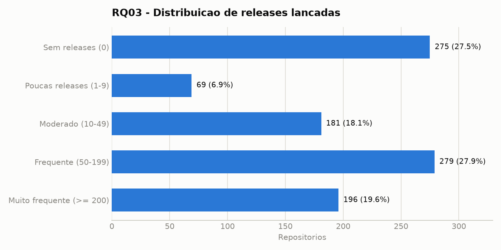
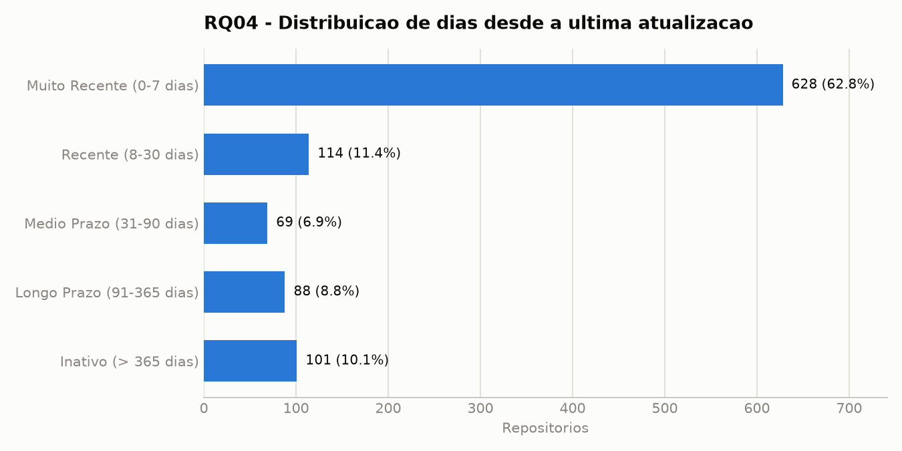

# Validação e Hipóteses - RQ03 e RQ04

Este documento descreve o processo de validação de consistência dos dados e a análise das hipóteses informais referentes às questões de pesquisa RQ03 (releases) e RQ04 (frequência de atualizações), com base no conjunto de dados final dos 1.000 repositórios mais populares do GitHub por quantidade de estrelas.

---

## RQ03 - Sistemas populares lançam releases com frequência?

Métrica: Número total de releases formais (`releases_count`) associadas ao repositório no GitHub.

### Estatísticas Gerais de Releases

| Estatística | Valor (releases) |
| --- | ---: |
| Mínimo | 0 |
| Média | 129,34 |
| Mediana | 42,00 |
| Q1 (25%) | 0,00 |
| Q3 (75%) | 152,25 |
| P90 | 352,10 |
| P95 | 613,25 |
| P99 | 1.000,00 |
| Máximo | 1.000 |

### Distribuição por Faixas de Releases

| Faixa | Repositórios | Percentual |
| --- | ---: | ---: |
| Sem releases (0) | 275 | 27,5% |
| Poucas releases (1 - 9) | 69 | 6,9% |
| Moderado (10 - 49) | 181 | 18,1% |
| Frequente (50 - 199) | 279 | 27,9% |
| Muito frequente (>= 200) | 196 | 19,6% |

### Visualização

### Outliers e Consistência
- Aplicando a regra do IQR:
  - \(IQR = 152,25 - 0,00 = 152,25\)
  - Limite superior de corte: \(152,25 + 1,5 \times 152,25 = 380,625\) releases
- Foram identificados **91 repositórios outliers** com mais de 380 releases.
- Uma parte destes outliers (como `langchain-ai/langchain`, `vercel/next.js`, `ggml-org/llama.cpp`, entre outros) atinge o limite máximo de 1.000 releases, que é o teto máximo de paginação retornado por padrão pela consulta ou pelo limite de busca configurado.
- Todos os repositórios possuem contagem de releases maior ou igual a zero.

### Hipótese Informal
A hipótese de que sistemas populares lançam releases com frequência é **parcialmente confirmada**. 
Por um lado, quase metade da base (47,5%) apresenta alta frequência de lançamentos (mais de 50 releases), com uma mediana de 42 releases na amostra total.
Por outro lado, 27,5% dos projetos populares possuem exatamente zero releases formais cadastradas no GitHub. Isso indica que uma fatia considerável de projetos de alta popularidade opta por outras formas de distribuição, como entrega contínua direto do branch padrão (`main`/`master`), uso de tags simples do git sem o recurso de "Releases" do GitHub, ou trata-se de repositórios de documentação/lista curada (ex. awesome lists) que não possuem versionamento de software.

---

## RQ04 - Sistemas populares são atualizados com frequência?

Métrica: Quantidade de dias decorridos desde o último push (`days_since_last_update`), calculado a partir do timestamp de atualização (`pushed_at` ou `updated_at`) em relação à data da coleta.

### Estatísticas Gerais de Dias desde a Última Atualização

| Estatística | Valor (dias) |
| --- | ---: |
| Mínimo | 0 |
| Média | 99,02 |
| Mediana | 1,00 |
| Q1 (25%) | 0,00 |
| Q3 (75%) | 37,25 |
| P90 | 367,50 |
| P95 | 730,00 |
| P99 | 958,67 |
| Máximo | 2.445 |

### Distribuição por Faixas de Atualização

| Faixa | Repositórios | Percentual |
| --- | ---: | ---: |
| Muito Recente (0 - 7 dias) | 628 | 62,8% |
| Recente (8 - 30 dias) | 114 | 11,4% |
| Médio Prazo (31 - 90 dias) | 69 | 6,9% |
| Longo Prazo (91 - 365 dias) | 88 | 8,8% |
| Inativo (> 365 dias) | 101 | 10,1% |

### Visualização

### Outliers e Consistência
- Aplicando a regra do IQR:
  - \(IQR = 37,25 - 0,00 = 37,25\)
  - Limite superior de corte de inatividade: \(37,25 + 1,5 \times 37,25 = 93,125\) dias
- Foram identificados **185 repositórios outliers** com mais de 93 dias sem receber novas atualizações.
- **Top 10 Outliers de Inatividade (Projetos Legados/Parados):**
  1. `exacity/deeplearningbook-chinese` (2.445 dias, cerca de 6,7 anos sem updates)
  2. `lib-pku/libpku` (1.681 dias)
  3. `floodsung/Deep-Learning-Papers-Reading-Roadmap` (1.355 dias)
  4. `resume/resume.github.com` (1.275 dias)
  5. `prakhar1989/awesome-courses` (1.197 dias)
  6. `geekxh/hello-algorithm` (1.157 dias)
  7. `FreeCodeCampChina/freecodecamp.cn` (1.124 dias)
  8. `yunjey/pytorch-tutorial` (1.094 dias)
  9. `eriklindernoren/ML-From-Scratch` (1.033 dias)
  10. `NARKOZ/hacker-scripts` (1.025 dias)
- A métrica `days_since_last_update` é estritamente não-negativa para todos os repositórios.

### Hipótese Informal
A hipótese de que sistemas populares são atualizados com frequência é **fortemente confirmada**. A mediana da base é de apenas 1 dia sem atualizações, o que significa que mais da metade de todos os repositórios analisados receberam atualizações nas últimas 24 a 48 horas. Além disso, 74,2% da amostra foi atualizada nos últimos 30 dias. Apenas uma minoria de 10,1% está inativa há mais de um ano, sendo compostos majoritariamente por tutoriais, roadmaps de leitura, livros estáticos ou projetos arquivados/consolidados que não demandam mais manutenção diária.
