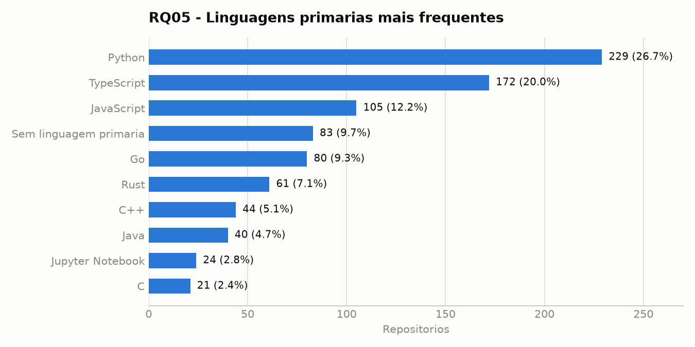
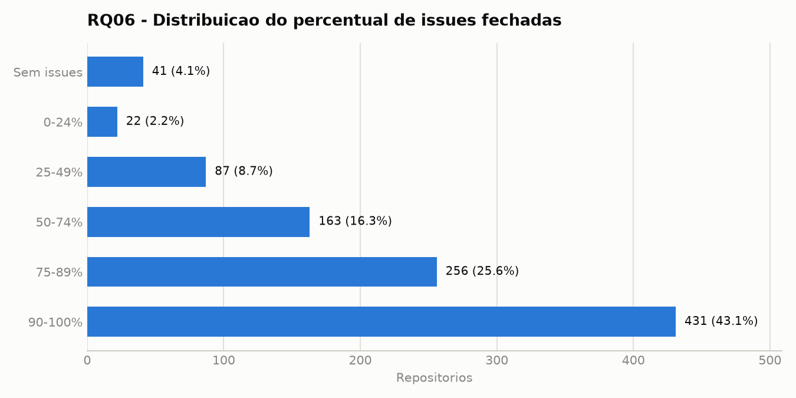
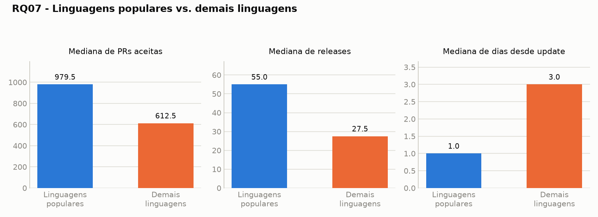

# Validacao de consistencia e hipoteses informais - RQ05, RQ06 e RQ07

## Base analisada

Arquivo consultado via DuckDB:

```bash
duckdb -c "select * from read_parquet('labs/lab01_repos_populares/data/parquet/repositories.parquet') limit 5;"
```

Resumo da base:

| Item | Valor |
| --- | ---: |
| Repositorios analisados | 1000 |
| `repo_id` distintos | 1000 |
| Inicio da coleta | 2026-08-13 18:13:22 |
| Fim da coleta | 2026-08-13 18:27:17 |

Nao foram encontrados `repo_id` duplicados. A amostra esta consistente com o recorte esperado de 1.000 repositorios populares.

## Fonte para linguagens mais populares

Para RQ05 e RQ07, a referencia adotada para "linguagens mais populares" foi mantida igual a configuracao do projeto:

- Fonte: GitHub Octoverse 2025
- URL: https://octoverse.github.com/
- Arquivo de referencia: `labs/lab01_repos_populares/config/popular_languages.json`
- Linguagens consideradas populares neste laboratorio: TypeScript, Python, JavaScript, Java, C++ e C#.

Essa definicao deve ser mantida nas proximas etapas para evitar mudanca de criterio entre as RQs.

## Valores ausentes

| Campo | Valores ausentes |
| --- | ---: |
| `primary_language` | 83 |
| `total_issues_count` | 0 |
| `closed_issues_ratio` | 41 |
| `accepted_pull_requests` | 0 |
| `releases_count` | 0 |
| `days_since_last_update` | 0 |

Observacoes:

- Os 83 valores ausentes em `primary_language` afetam diretamente RQ05 e RQ07.
- Os 41 valores nulos em `closed_issues_ratio` ocorrem em repositorios sem issues (`total_issues_count = 0`), portanto nao representam erro de coleta; representam ausencia de base para calcular percentual.
- As metricas de RQ07 nao possuem valores ausentes.

## RQ05 - Sistemas populares sao escritos nas linguagens mais populares?

Metrica: linguagem primaria de cada repositorio.

### Distribuicao por grupo

| Grupo | Repositorios | Percentual | Media de estrelas | Mediana de estrelas |
| --- | ---: | ---: | ---: | ---: |
| Linguagens populares | 598 | 59,8% | 64.844,6 | 47.539 |
| Demais linguagens ou sem linguagem | 402 | 40,2% | 66.486,3 | 48.442 |

### Linguagens mais frequentes

| Linguagem primaria | Repositorios | Percentual | Popular pela fonte? |
| --- | ---: | ---: | --- |
| Python | 229 | 22,9% | Sim |
| TypeScript | 172 | 17,2% | Sim |
| JavaScript | 105 | 10,5% | Sim |
| Sem linguagem primaria | 83 | 8,3% | Nao |
| Go | 80 | 8,0% | Nao |
| Rust | 61 | 6,1% | Nao |
| C++ | 44 | 4,4% | Sim |
| Java | 40 | 4,0% | Sim |
| Jupyter Notebook | 24 | 2,4% | Nao |
| C | 21 | 2,1% | Nao |
| Shell | 20 | 2,0% | Nao |

### Visualizacao



Grafico mostra as 10 linguagens primarias mais frequentes (859 dos 1000 repositorios); as demais 141 se distribuem entre outras ~35 linguagens de cauda longa.

### Outliers e consistencia

- Foram identificados 45 grupos de linguagem, contando o grupo `SEM_LINGUAGEM`.
- 13 linguagens aparecem em apenas um repositorio, indicando cauda longa esperada em uma amostra de repositorios populares.
- O maior grupo e Python, com 229 repositorios.
- A ausencia de linguagem primaria em 83 repositorios deve ser mencionada como limitacao, pois esses casos nao podem confirmar a RQ05.

### Hipotese informal

A hipotese inicial e que sistemas populares tendem a estar concentrados em linguagens populares, mas nao exclusivamente. A base apoia parcialmente essa expectativa: 59,8% dos repositorios usam linguagens definidas como populares pela referencia adotada. Ainda assim, 40,2% estao em outras linguagens ou nao possuem linguagem primaria identificada, o que indica que popularidade do sistema nao depende apenas da linguagem primaria.

## RQ06 - Sistemas populares possuem um alto percentual de issues fechadas?

Metrica: razao entre issues fechadas e total de issues.

Formula usada no dataset:

```text
closed_issues_ratio = closed_issues_count / total_issues_count
```

### Distribuicao da razao de issues fechadas

| Estatistica | Valor |
| --- | ---: |
| Repositorios analisados | 1000 |
| Repositorios sem issues | 41 |
| Razao nula | 41 |
| Minimo | 0,0780 |
| Media | 0,8042 |
| Mediana | 0,8754 |
| Q1 | 0,7166 |
| Q3 | 0,9680 |
| P90 | 0,9930 |
| P95 | 0,9977 |
| P99 | 1,0000 |
| Maximo | 1,0000 |

### Faixas de percentual de issues fechadas

| Faixa | Repositorios | Percentual |
| --- | ---: | ---: |
| Sem issues | 41 | 4,1% |
| 0-24% | 22 | 2,2% |
| 25-49% | 87 | 8,7% |
| 50-74% | 163 | 16,3% |
| 75-89% | 256 | 25,6% |
| 90-100% | 431 | 43,1% |

### Visualizacao



### Outliers e consistencia

- A metrica `closed_issues_ratio` e limitada entre 0 e 1, entao os extremos esperados sao proximos de 0% e 100%.
- Apenas 109 repositorios possuem razao abaixo de 50%.
- Usando IQR em `total_issues_count`, o limite superior foi 12.097 issues; 101 repositorios ficam acima desse limite. Esses casos sao outliers de volume, nao necessariamente problemas de qualidade.
- Exemplos de alto volume de issues: `microsoft/vscode`, `flutter/flutter`, `llvm/llvm-project`, `cockroachdb/cockroach`, `anthropics/claude-code`, `python/cpython`, `home-assistant/core`, `golang/go`, `rust-lang/rust` e `godotengine/godot`.

### Hipotese informal

A hipotese inicial e que sistemas populares possuem alto percentual de issues fechadas, porque projetos com grande visibilidade tendem a ter processos de triagem e manutencao mais maduros. Os dados apoiam essa hipotese: a mediana da razao de issues fechadas e 87,54%, e 68,7% dos repositorios possuem pelo menos 75% das issues fechadas. A ressalva e que projetos com muitas issues abertas ainda existem, especialmente em repositorios muito grandes ou com alto fluxo de usuarios.

## RQ07 - Sistemas escritos em linguagens mais populares recebem mais contribuicao externa, lancam mais releases e sao atualizados com mais frequencia?

Metricas:

- Contribuicao externa: `accepted_pull_requests`.
- Releases: `releases_count`.
- Frequencia de atualizacao: `days_since_last_update`; quanto menor o valor, mais recente e a atualizacao.

### Resultado dividido por grupo de linguagem

| Grupo | Repositorios | Mediana PRs aceitas | Media PRs aceitas | Mediana releases | Media releases | Mediana dias desde update | Media dias desde update |
| --- | ---: | ---: | ---: | ---: | ---: | ---: | ---: |
| Linguagens populares | 598 | 979,5 | 4.477,3 | 55,0 | 150,9 | 1,0 | 79,7 |
| Demais linguagens ou sem linguagem | 402 | 612,5 | 4.080,2 | 27,5 | 97,3 | 3,0 | 127,8 |

### Percentis por grupo

| Grupo | P75 PRs | P90 PRs | P95 PRs | P75 releases | P90 releases | P95 releases | P75 dias update | P90 dias update | P95 dias update |
| --- | ---: | ---: | ---: | ---: | ---: | ---: | ---: | ---: | ---: |
| Linguagens populares | 3.900,5 | 12.506,6 | 19.892,9 | 177,8 | 436,5 | 758,2 | 18,8 | 238,1 | 722,0 |
| Demais linguagens ou sem linguagem | 2.623,5 | 9.072,0 | 19.684,9 | 130,0 | 281,6 | 423,0 | 70,5 | 630,7 | 738,9 |

### Quebra por linguagem mais frequente

| Linguagem | Repositorios | Mediana PRs | Mediana releases | Mediana dias desde update |
| --- | ---: | ---: | ---: | ---: |
| Python | 229 | 560,0 | 20,0 | 2,0 |
| TypeScript | 172 | 2.047,0 | 150,0 | 0,0 |
| JavaScript | 105 | 603,0 | 39,0 | 5,0 |
| Sem linguagem primaria | 83 | 122,0 | 0,0 | 115,0 |
| Go | 80 | 1.407,0 | 136,5 | 0,0 |
| Rust | 61 | 2.512,0 | 102,0 | 0,0 |
| C++ | 44 | 1.279,5 | 59,0 | 0,0 |
| Java | 40 | 966,5 | 56,0 | 1,0 |

### Visualizacao



### Outliers e consistencia

Usando IQR para identificar valores altos:

| Grupo | Outliers em PRs aceitas | Outliers em releases | Outliers de update antigo |
| --- | ---: | ---: | ---: |
| Linguagens populares | 81 | 67 | 92 |
| Demais linguagens ou sem linguagem | 45 | 24 | 93 |

Observacoes:

- PRs aceitas e releases possuem distribuicoes muito assimetricas: poucos repositorios concentram valores extremamente altos.
- Exemplos de outliers em PRs aceitas incluem `firstcontributions/first-contributions`, `llvm/llvm-project`, `elastic/elasticsearch`, `getsentry/sentry`, `home-assistant/core`, `cockroachdb/cockroach`, `rust-lang/rust`, `grafana/grafana`, `ClickHouse/ClickHouse` e `kubernetes/kubernetes`.
- Exemplos de outliers em releases incluem `langchain-ai/langchain`, `vercel/next.js`, `ggml-org/llama.cpp`, `electron/electron`, `storybookjs/storybook`, `home-assistant/core`, `zed-industries/zed`, `lobehub/lobehub`, `ruvnet/ruflo` e `withastro/astro`.
- 628 repositorios foram atualizados nos ultimos 7 dias da coleta, indicando base muito ativa.
- Repositorios sem linguagem primaria tem mediana de 115 dias desde a ultima atualizacao, bem maior que os grupos principais; isso reforca a necessidade de tratar esse grupo separadamente.

### Hipotese informal

A hipotese inicial e que repositorios escritos em linguagens populares recebem mais contribuicao externa, lancam mais releases e sao atualizados com mais frequencia. Os dados apoiam essa hipotese de forma moderada: o grupo de linguagens populares apresenta mediana maior de PRs aceitas, mediana maior de releases e mediana menor de dias desde a ultima atualizacao. Entretanto, ha excecoes importantes em linguagens nao classificadas como populares pela fonte adotada, como Go e Rust, que tambem apresentam altos niveis de contribuicao e atualizacao. Portanto, a linguagem parece estar associada a atividade do projeto, mas nao deve ser interpretada como unica causa.

## Consultas DuckDB usadas

As consultas foram feitas diretamente sobre o Parquet:

```sql
select *
from read_parquet('labs/lab01_repos_populares/data/parquet/repositories.parquet');
```

Principais campos usados:

- RQ05: `primary_language`, `is_popular_language`, `stars_count`.
- RQ06: `closed_issues_count`, `total_issues_count`, `closed_issues_ratio`.
- RQ07: `accepted_pull_requests`, `releases_count`, `days_since_last_update`, `is_popular_language`.
