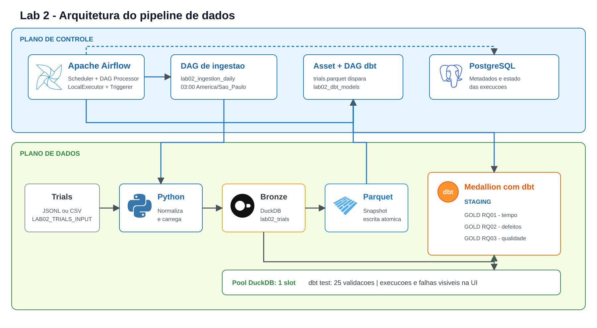
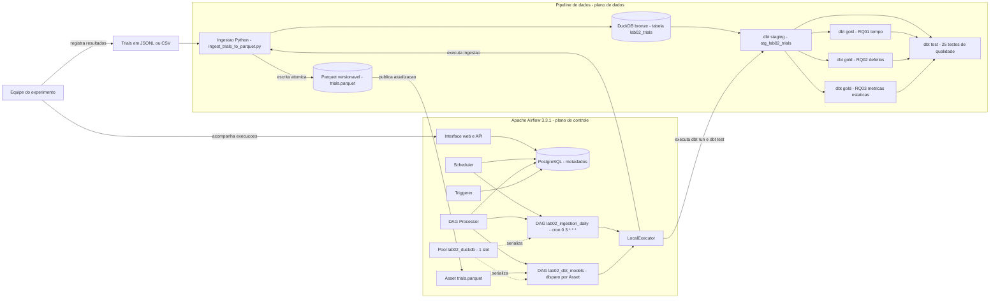

# Arquitetura do pipeline de dados do Lab 2

## Objetivo

O pipeline automatiza a preparacao dos dados do experimento que compara desenvolvimento manual e
desenvolvimento assistido por IA. O Apache Airflow coordena a ingestao em Python, a persistencia no
DuckDB e em Parquet e a execucao dos modelos e testes dbt.

A arquitetura separa dois planos:

- **Plano de controle:** Airflow agenda, dispara, limita a concorrencia e registra o estado das
  execucoes no PostgreSQL.
- **Plano de dados:** Python, DuckDB, Parquet e dbt processam e materializam os dados analiticos.

## Diagrama da arquitetura

Uma versao editavel e ilustrada esta disponivel em
[`lab02_pipeline_architecture.excalidraw`](lab02_pipeline_architecture.excalidraw). Abra o arquivo
diretamente no Excalidraw por **Open** ou arraste-o para a area de desenho. Os logos de Airflow,
Python, DuckDB, PostgreSQL e Parquet ja estao incorporados ao arquivo, portanto ele nao depende de
imagens externas.



O bloco abaixo e uma alternativa simplificada para Mermaid. Ao usar **Import Mermaid** no
Excalidraw ou no draw.io, copie somente o conteudo entre as cercas de codigo: a primeira linha
colada deve ser `flowchart LR`. Nao inclua as linhas de abertura e fechamento da cerca de codigo e
mantenha as aspas duplas do exemplo.



## Fluxo de processamento

1. Os trials sao registrados em um arquivo JSONL ou CSV. O caminho e configurado pela variavel
   `LAB02_TRIALS_INPUT`; o arquivo sintetico do repositorio e usado por padrao.
2. O scheduler inicia a DAG `lab02_ingestion_daily` diariamente as 03:00 no fuso
   `America/Sao_Paulo`.
3. A tarefa executa `ingest_trials_to_parquet.py`, normaliza os tipos e substitui a tabela bronze
   `lab02_trials` no warehouse compartilhado `data/warehouse.duckdb`.
4. A mesma ingestao exporta `trials.parquet` para um arquivo temporario. O arquivo definitivo so e
   substituido depois que a exportacao termina, evitando que consumidores leiam um Parquet parcial.
5. A conclusao da ingestao publica uma atualizacao do Asset `trials.parquet` no Airflow.
6. A atualizacao dispara `lab02_dbt_models`, que executa `dbt run` para `staging.lab02` e
   `gold.lab02`.
7. A DAG executa `dbt test` somente depois da materializacao dos modelos. Uma falha de qualidade
   deixa a execucao visivelmente marcada como falha na interface do Airflow.

## Camadas de dados

| Camada | Implementacao | Responsabilidade |
| --- | --- | --- |
| Entrada | JSONL ou CSV | Registros produzidos durante os trials do experimento. |
| Bronze | `lab02_trials` no DuckDB | Dados tipados e consolidados pela ingestao Python. |
| Intercambio | `trials.parquet` | Snapshot portavel, compacto e versionavel da tabela de trials. |
| Staging | `stg_lab02_trials` | Padronizacao e campos derivados usados pelas perguntas de pesquisa. |
| Gold | `gold_lab02_rq01_time` | Medianas e contagens para a analise de tempo. |
| Gold | `gold_lab02_rq02_defects` | Taxas de sucesso e indicadores de defeitos. |
| Gold | `gold_lab02_rq03_static_metrics` | Complexidade, manutenibilidade, LOC e duplicacao. |

## Decisoes arquiteturais

### Airflow

O Airflow foi escolhido para tornar o fluxo observavel e reproduzivel. Ele registra tentativas,
duracao, logs e dependencias, alem de permitir execucao agendada ou manual. O `LocalExecutor` e
suficiente para o volume do laboratorio e evita a complexidade de um cluster distribuido.

### Python e Parquet

Python reaproveita o codigo de ingestao e validacao do repositorio. O Parquet preserva tipos, reduz
o tamanho dos dados e desacopla a coleta das transformacoes. A troca atomica do arquivo impede
leituras incompletas.

### DuckDB e dbt

O DuckDB executa analises colunares localmente sem exigir um servidor de banco dedicado para os
dados do experimento. O dbt mantem as transformacoes SQL versionadas, documentadas e testaveis. A
combinacao e adequada ao volume do laboratorio e permite regenerar todas as tabelas analiticas a
partir dos dados de entrada.

### Concorrencia e consistencia

As duas DAGs permitem apenas uma execucao ativa cada. Alem disso, todas as tarefas que acessam o
warehouse usam o pool `lab02_duckdb`, configurado com um unico slot. Assim, a ingestao e o dbt nao
tentam escrever simultaneamente no mesmo arquivo DuckDB.

## Implantacao local

Todos os componentes rodam em containers Docker. O Compose inicia PostgreSQL, API server,
scheduler, processador de DAGs e triggerer. O repositorio e montado em `/opt/airflow/project`, de
forma que a ingestao, o profile dbt, o warehouse e os modelos sejam compartilhados pelos servicos.

```bash
docker compose build
docker compose up airflow-init
docker compose up -d
```

A interface fica em <http://localhost:8080>, com credenciais locais `airflow` / `airflow`.
