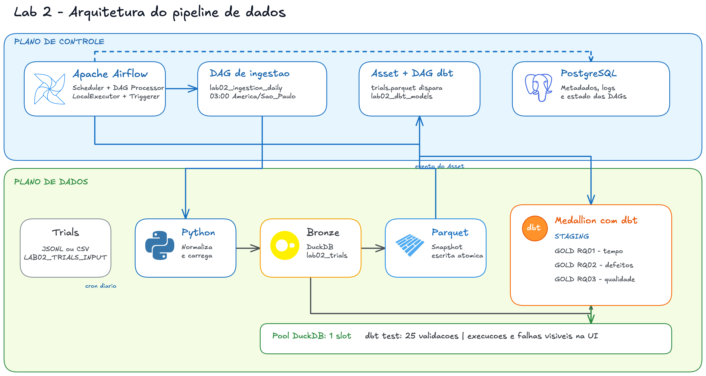
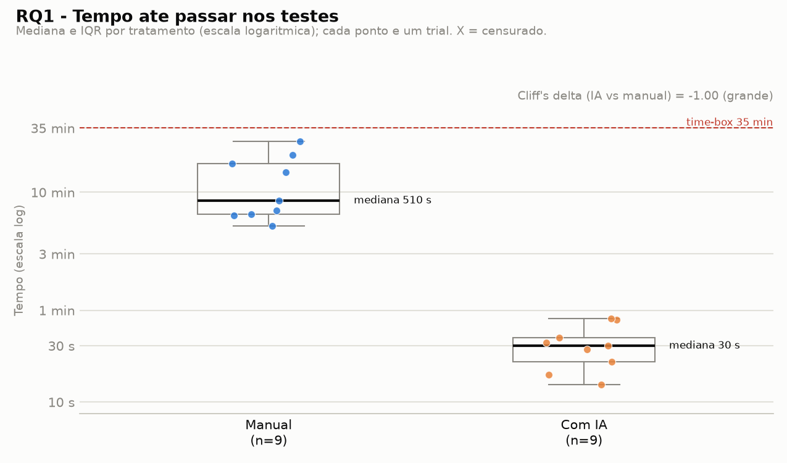
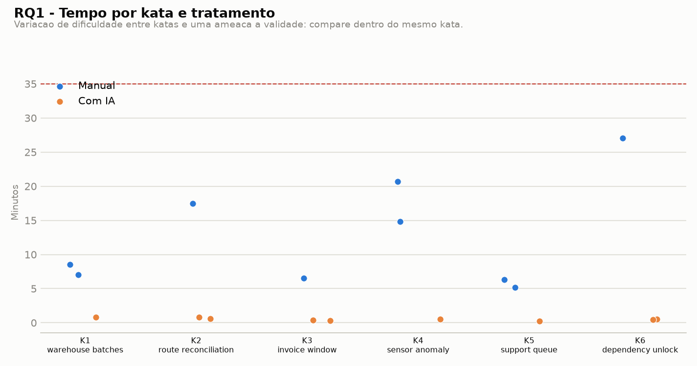
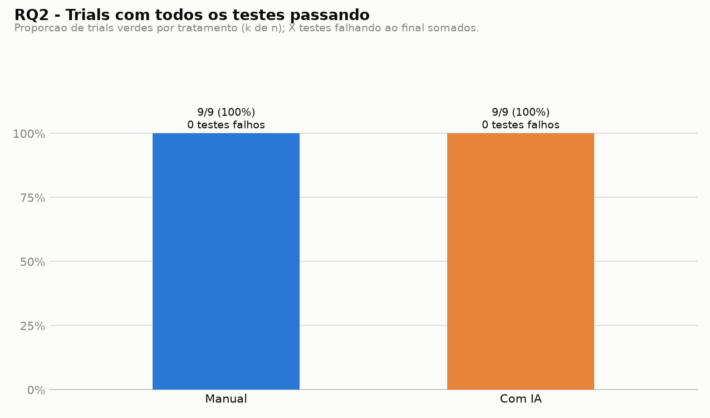
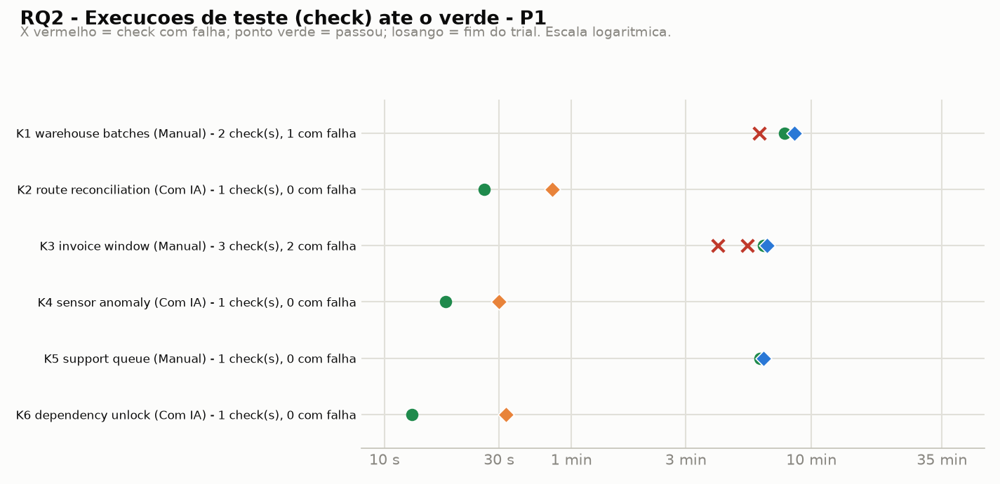
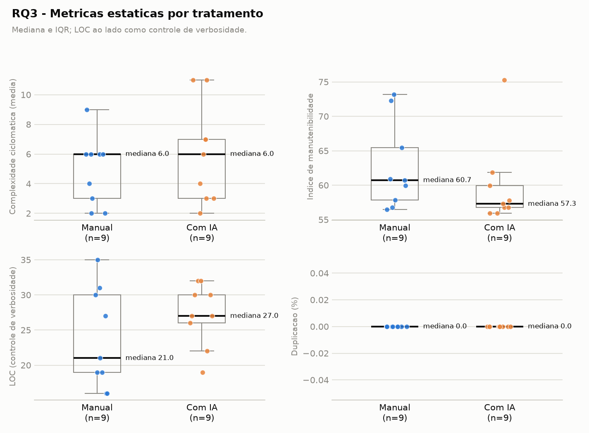
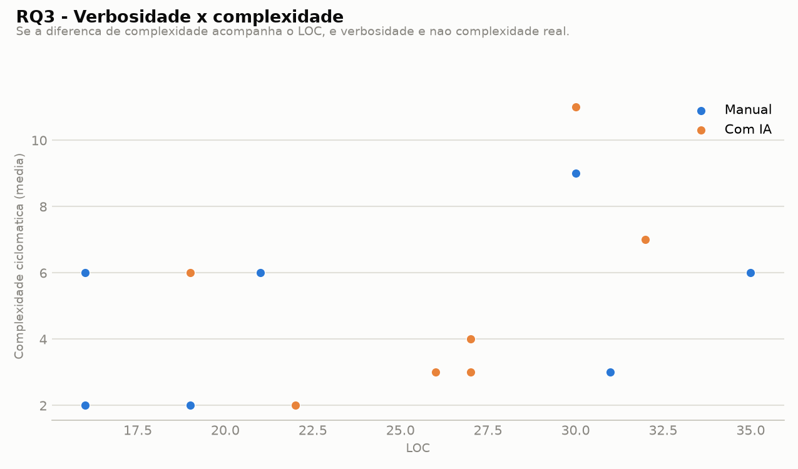
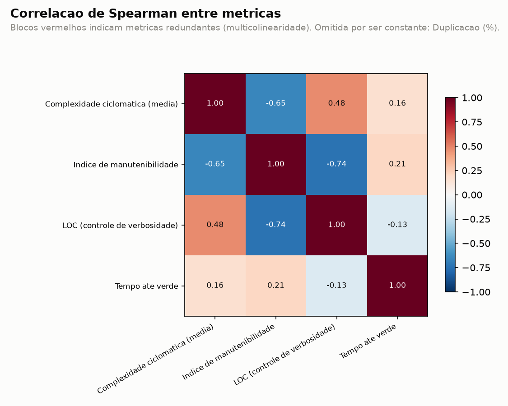
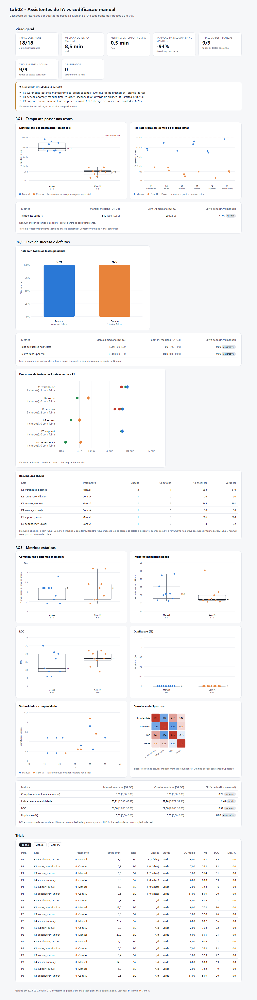

# Relatorio final - Lab02: assistentes de IA vs codificacao manual

Repositorio: https://github.com/JoaoRajao/lab-medicao
Quadro do grupo (GitHub Projects): https://github.com/users/JoaoRajao/projects/4
Dashboard: [`docs/lab02/dashboard.html`](dashboard.html) (gerado por `python -m labs.lab02_ia_vs_manual.analysis.dashboard`)

## 1. Introducao

Experimento controlado (crossover within-subject, ordem contrabalanceada) que compara a resolucao de
katas em Python com e sem assistente de IA, em tempo, taxa de sucesso nos testes e qualidade estrutural
do codigo. Tres participantes resolveram os mesmos seis katas, totalizando 18 trials (9 por tratamento).

### Questoes de pesquisa e hipoteses

Fonte: `docs/lab02/experiment_design.md`.

| RQ | Questao | H0 | H1 |
| --- | --- | --- | --- |
| RQ1 | O assistente de IA reduz o tempo necessario para resolver uma tarefa? | Nao ha diferenca na mediana do tempo ate passar nos testes entre os tratamentos. | O tratamento com IA reduz a mediana do tempo ate passar nos testes. |
| RQ2 | O assistente de IA reduz a quantidade de defeitos? | Nao ha diferenca na taxa de testes passando ao final do time-box. | O tratamento com IA aumenta a taxa de testes passando e reduz testes falhando. |
| RQ3 | O assistente de IA altera complexidade ou duplicacao? | Nao ha diferenca nas metricas estaticas entre tratamentos. | O tratamento com IA altera complexidade ciclomatica, duplicacao, LOC ou indice de manutenibilidade. |

### Variaveis

- Independente: tratamento (`manual` ou `ai_assisted`).
- Dependentes: `time_to_green_seconds`, `censored`, `tests_passed`, `tests_failed`,
  `acceptance_success_rate`, `cyclomatic_complexity_avg`, `maintainability_index`, `loc`, `duplication_pct`.
- Controle: linguagem (Python), time-box (35 min), suite de testes (pytest), metricas estaticas (Radon, jscpd).

## 2. Metodologia

### 2.1 Participantes e desenho

Tres participantes resolvem os mesmos seis katas, metade com IA e metade sem, em ordem contrabalanceada.
P1 = Pedro Moreira Ramos, P2 = Joao Vitor Pedersoli Rajao, P3 = Otavio Salomao Ferreira.

| Participante | K1 | K2 | K3 | K4 | K5 | K6 |
| --- | --- | --- | --- | --- | --- | --- |
| P1 | manual | ai_assisted | manual | ai_assisted | manual | ai_assisted |
| P2 | ai_assisted | manual | ai_assisted | manual | ai_assisted | manual |
| P3 | manual | ai_assisted | ai_assisted | manual | manual | ai_assisted |

### 2.2 Katas

Katas autorais, com testes de aceitacao em pytest (`labs/lab02_ia_vs_manual/katas/`):
K1 `warehouse_batches`, K2 `route_reconciliation`, K3 `invoice_window`, K4 `sensor_anomaly`,
K5 `support_queue`, K6 `dependency_unlock`. Validacao de dificuldade e indexacao:
`docs/lab02/katas_validacao.md` e `docs/lab02/kata_baselines.md`.

### 2.3 Ambiente e ferramentas

| Item | Valor |
| --- | --- |
| Linguagem | Python 3.14 |
| Testes | pytest 9.1.1 |
| Metricas estaticas | radon 6.0.1 (complexidade, LOC, manutenibilidade); jscpd via npx (duplicacao) |
| Armazenamento | DuckDB 1.5.5 + Parquet |
| Transformacao | dbt-duckdb 1.11.0 (`models/staging/lab02`, `models/gold/lab02`) |
| Analise e graficos | pandas 3.0.6, matplotlib 3.11.1 |
| Orquestracao | Airflow 3.3.1 (`airflow/`, `docs/lab02/airflow_architecture.md`) |

### 2.4 Assistente de IA

| Participante | Assistente nos trials `ai_assisted` | Versao / modelo |
| --- | --- | --- |
| P1 | Claude Code | Claude Sonnet 5 (`claude-sonnet-5`) |
| P2 | ChatGPT | nao registrada no experimento |
| P3 | ChatGPT | nao registrada no experimento |

O desenho original previa ChatGPT para todos os participantes; a diferenca no P1 e tratada na secao 5.

### 2.5 Procedimento de coleta

1. `run_trial_timer.py start` marca o inicio da tentativa; `check` roda os testes sem parar o relogio;
   `stop` grava o tempo decorrido. Trial que nao fica verde em 35 min (2.100 s) e registrado como
   censurado, nunca descartado.
2. `collect_static_metrics.py` mede o `solution.py` do trial.
3. Um JSONL por participante em `labs/lab02_ia_vs_manual/data/raw/`, ingerido com
   `ingest_trials_to_parquet.py` e modelado no dbt.
4. Nos trials `manual`, a solucao e escrita pelo participante, sem sugestoes de IA.
5. A ferramenta so grava o resultado final do trial (`stop`); as execucoes intermediarias de `check` nao sao
   registradas. Para o P1 elas foram recuperadas do log da sessao de coleta e estao em
   `labs/lab02_ia_vs_manual/data/raw/trials_pedro_checks.jsonl` (Anexo B); P2 e P3 nao possuem esse registro.

### 2.6 Tratamento de dados e analise

- Consolidacao dos tres JSONL e validacao de integridade: `labs/lab02_ia_vs_manual/analysis/data.py`.
- Estatistica descritiva por mediana e IQR (N pequeno e assimetria); outliers pela regra 1,5 x IQR dentro
  de cada tratamento, documentados antes dos testes.
- Teste de Wilcoxon pareado (exato, bicaudal, alfa = 0,05). O pareamento e por participante: para cada
  participante compara-se a media dos trials `ai_assisted` contra a dos `manual`, o que gera 3 pares.
  Scripts: `labs/lab02_ia_vs_manual/analysis/rq1_rq2_wilcoxon.py` e `rq3_static_metrics.py`.
- Tamanho de efeito: Cliff's delta (IA vs manual), com os limiares de Romano et al. (0,147 / 0,33 / 0,474).
  Nao foi aplicada correcao para multiplos testes; os resultados sao exploratorios.

### 2.7 Arquitetura do pipeline



Os trials sao coletados em JSONL, ingeridos no DuckDB/Parquet, transformados pelo dbt (staging e gold por
RQ) e consumidos pelas analises estatisticas e pelo dashboard. A orquestracao diaria com Airflow esta
descrita em `docs/lab02/airflow_architecture.md`.

## 3. Resultados

Figuras geradas por `python -m labs.lab02_ia_vs_manual.analysis.dashboard` em `docs/lab02/assets/`.

### 3.1 RQ1 - Tempo

Os graficos de tempo usam escala logaritmica porque os tempos com IA (segundos) e manuais (minutos) diferem em
uma ordem de grandeza.




| Tratamento | n | Mediana (s) | Q1 | Q3 | IQR | Min | Max | Censurados |
| --- | --- | --- | --- | --- | --- | --- | --- | --- |
| Manual | 9 | 510 | 393 | 1.050 | 657 | 310 | 1.622 | 0 |
| Com IA | 9 | 30 | 22 | 35 | 13 | 14 | 51 | 0 |

Wilcoxon (3 pares): W = 0, p = 0,25, mediana do delta = -511,67 s. Cliff's delta = -1,00 (efeito grande):
todos os 9 trials com IA foram mais rapidos que todos os 9 trials manuais.
Decisao sobre H0: **nao rejeitada** (p = 0,25 > 0,05). Com 3 pares, 0,25 e o menor p-valor possivel no
teste exato bicaudal, portanto o teste nao tem poder para rejeitar H0 independentemente dos dados.

### 3.2 RQ2 - Taxa de sucesso e defeitos



| Tratamento | Trials verdes | Testes falhos (soma) | Mediana da taxa de sucesso |
| --- | --- | --- | --- |
| Manual | 9/9 | 0 | 1,0 |
| Com IA | 9/9 | 0 | 1,0 |

Wilcoxon: p = 1,00 (todas as diferencas pareadas iguais a zero), Cliff's delta = 0,00. Decisao sobre H0:
**nao rejeitada**. Todos os trials terminaram verdes, entao a metrica nao discrimina os tratamentos.

**Execucoes de teste ate o verde (P1).** O resultado final e verde em todos os trials, mas o registro do P1
mostra o caminho ate ele: foram 9 execucoes de `check` nos 6 trials.



| Trial (P1) | Tratamento | Checks | Com falha | 1o check (s) | Verde (s) |
| --- | --- | ---: | ---: | ---: | ---: |
| K1 warehouse_batches | manual | 2 | 1 | 363 | 510 |
| K2 route_reconciliation | com IA | 1 | 0 | 26 | 50 |
| K3 invoice_window | manual | 3 | 2 | 244 | 393 |
| K4 sensor_anomaly | com IA | 1 | 0 | 18 | 30 |
| K5 support_queue | manual | 1 | 0 | 366 | 380 |
| K6 dependency_unlock | com IA | 1 | 0 | 13 | 32 |

Nos trials manuais do P1 houve 6 checks, 3 com falha (K1: 1, por erro de coleta; K3: 2, por resultado incorreto),
antes do verde. Nos trials com IA houve 3 checks e nenhuma falha: o primeiro check ja passou. E uma observacao
descritiva de um unico participante (3 trials por tratamento) e nao substitui a metrica de RQ2, que considera
apenas o estado final.

### 3.3 RQ3 - Metricas estaticas





A duplicacao foi omitida da matriz de correlacao por ser constante (0% em todos os trials).

| Metrica | Manual: mediana [Q1-Q3] | Com IA: mediana [Q1-Q3] | p (Wilcoxon) | Cliff's delta |
| --- | --- | --- | --- | --- |
| Complexidade ciclomatica (media) | 6 [3-6] | 6 [3-7] | 0,75 | +0,22 (pequeno) |
| Indice de manutenibilidade | 60,72 [57,83-65,47] | 57,28 [56,77-59,96] | 0,50 | -0,40 (medio) |
| LOC | 21 [19-30] | 27 [26-30] | 0,50 | +0,31 (pequeno) |
| Duplicacao (%) | 0 [0-0] | 0 [0-0] | 1,00 | 0,00 |

Decisao sobre H0: **nao rejeitada** para as quatro metricas.

### 3.4 Outliers e dados excluidos

Nenhum outlier de tempo, de taxa de sucesso ou de falhas. Outliers estruturais (regra 1,5 x IQR, dentro
de cada tratamento): indice de manutenibilidade `P2-support_queue-ai_assisted` = 75,29 e LOC
`P1-sensor_anomaly-ai_assisted` = 19. Nenhum trial foi censurado ou descartado.

### 3.5 Dashboard

Os resultados acima estao consolidados no dashboard do experimento: [`dashboard.html`](dashboard.html). O arquivo
e autocontido (sem dependencias externas); basta baixa-lo e abri-lo no navegador. Ele reune os indicadores
gerais, os graficos e as tabelas de mediana/IQR e Cliff's delta de cada RQ, a linha do tempo dos checks do P1 e a
tabela dos 18 trials, ordenavel e filtravel por tratamento. Os pontos dos graficos mostram o trial ao passar o
mouse. Para regenera-lo com os dados atuais: `python -m labs.lab02_ia_vs_manual.analysis.dashboard`.



## 4. Discussao

- **RQ1.** O tratamento com IA teve mediana de 30 s contra 510 s no manual, e todos os trials com IA
  ficaram abaixo do menor tempo manual (310 s), o que da efeito grande. Os katas sao pequenos e o
  assistente produz a solucao quase de imediato, entao o tempo com IA reflete sobretudo o ciclo de pedir,
  aplicar e rodar os testes. O teste de Wilcoxon nao rejeita H0 porque, com 3 pares, nao consegue: a
  evidencia aqui e o tamanho de efeito e a consistencia entre todos os trials, nao o p-valor.
- **RQ2.** Todos os 18 trials ficaram verdes. Ha efeito de teto: a suite de aceitacao dos katas e curta
  e nao distingue a qualidade funcional entre os tratamentos, entao nao ha base para dizer que a IA
  reduz ou aumenta defeitos. O registro de checks do P1 acrescenta um sinal descritivo: as 3 execucoes com
  falha ocorreram todas nos trials manuais, enquanto os trials com IA passaram no primeiro check.
- **RQ3.** A complexidade ciclomatica e a duplicacao ficaram praticamente iguais. Com IA, o LOC mediano
  e maior (27 vs 21) e o indice de manutenibilidade e menor (57,3 vs 60,7). Como o indice do Radon
  penaliza o tamanho do codigo, o padrao e coerente com codigo um pouco mais verboso, e nao mais
  complexo. Os efeitos sao pequenos a medios e nenhum e estatisticamente detectavel com esta amostra.
- **Sintese.** A IA reduziu muito o tempo sem alterar o resultado funcional e com impacto estrutural
  pequeno (mais linhas, complexidade equivalente). Por ser um estudo com 3 participantes e 6 katas
  pequenos, as conclusoes se aplicam a este contexto e devem ser lidas como evidencia exploratoria.

## 5. Ameacas a validade

| Ameaca | Situacao neste experimento | Mitigacao / tratamento |
| --- | --- | --- |
| Efeito de aprendizado | Ordem alterna por participante. | Ordem contrabalanceada (secao 2.1). |
| Variacao de dificuldade entre katas | `dependency_unlock` saiu mais complexo que os demais (`docs/lab02/kata_baselines.md`). | Comparar dentro do mesmo kata (`rq1_tempo_por_kata.png`). |
| Memorizacao de katas conhecidos | Nenhum kata encontrado como problema indexado (`docs/lab02/katas_validacao.md`). | Katas autorais, o que reduz o risco de o assistente reproduzir solucao ja vista, mas introduz as duas ameacas seguintes. |
| Amostra pequena | 3 participantes; o pareamento por participante rende so 3 pares, e o menor p-valor possivel no Wilcoxon exato e 0,25. | Reportar tamanho de efeito (Cliff's delta) e mediana/IQR; tratar como exploratorio. |
| Assistente diferente do desenho | O desenho previa ChatGPT; P1 usou Claude Code, P2 e P3 usaram ChatGPT (secao 2.4). | Assistente registrado por trial; nao ha analise estratificada por assistente. |
| Familiaridade previa com IA | Nao medida. | Analise pareada por participante. |
| Registro do tempo | Os tempos de P2 e P3 foram consolidados a partir de registros por participante e nem todos os trials trazem timestamps consistentes com o cronometro do laboratorio; o dashboard sinaliza esses casos. | Tratar a RQ1 como exploratoria; a conclusao qualitativa (ordem de grandeza) nao depende da precisao ao segundo. |
| Katas autorais e de curta duracao | Os katas foram desenvolvidos pelo proprio grupo e sao pequenos (solucoes de 16 a 35 linhas de codigo nos dados coletados), pensados para caber no time-box de 35 min. Tarefas curtas e bem delimitadas sao justamente o cenario em que um assistente de IA gera a solucao quase de imediato (mediana de 30 s contra 510 s no manual), o que tende a favorecer o tratamento com IA e limita a generalizacao para tarefas maiores ou ambiguas. | Reportar o resultado como especifico deste tipo de tarefa; em trabalhos futuros, usar katas mais longos e de dificuldade crescente. |
| Conhecimento previo do problema pelos participantes | Como os katas foram elaborados pelo grupo, os participantes conheciam o dominio e o formato dos problemas, o que reduz o tempo de compreensao e de planejamento da solucao. O mesmo viés ocorreria com katas prontos da internet: o participante leria o enunciado e pensaria na solucao antes de iniciar a medicao, e essa etapa de compreensao nao entra no tempo registrado. Por isso o viés nao pode ser eliminado, so reduzido. | O mesmo conjunto de katas foi usado nos dois tratamentos e a ordem foi contrabalanceada, de modo que o conhecimento previo afeta ambos; mesmo assim ele pode comprimir mais o tempo manual do que o com IA. Em trabalhos futuros, aplicar katas desconhecidos elaborados por terceiros e cronometrar desde a leitura do enunciado. |
| Efeito de teto no RQ2 | Todos os trials ficaram verdes. | Ampliar a suite de testes ou usar katas mais dificeis em trabalhos futuros. |

## 6. Conclusao

- **RQ1:** o uso de IA reduziu o tempo ate passar nos testes de forma consistente (mediana 30 s vs 510 s,
  Cliff's delta = -1,00), mas H0 nao pode ser rejeitada pelo Wilcoxon pareado com 3 pares.
- **RQ2:** sem diferenca; todos os trials passaram em todos os testes.
- **RQ3:** sem diferenca estatisticamente detectavel; ha indicio de codigo um pouco mais extenso com IA
  (LOC +6 na mediana, indice de manutenibilidade -3,4), com complexidade equivalente.
- **Proximos passos:** repetir com mais participantes (pareamento por participante exige mais de 5 pares
  para que o teste exato consiga rejeitar H0), katas mais longos e desconhecidos aos participantes (elaborados por terceiros), cronometragem desde a leitura do enunciado e uma suite de testes mais discriminante.

## 7. Reproducao

```bash
pip install -r requirements.txt
python -m pytest --collect-only labs/lab02_ia_vs_manual/katas
python -m labs.lab02_ia_vs_manual.scripts.run_trial_timer start --participant P1 --kata warehouse_batches --treatment manual
dbt run --select staging.lab02 gold.lab02
dbt test --select staging.lab02 gold.lab02
python -m labs.lab02_ia_vs_manual.analysis.rq1_rq2_wilcoxon
python -m labs.lab02_ia_vs_manual.analysis.rq3_static_metrics
python -m labs.lab02_ia_vs_manual.analysis.dashboard
```

Snapshots do quadro: `data/kanban_snapshots/` (`Lab02S01`, `Lab02S02`, `Lab02S03` ao final).

## 8. Anexo A - Dados por trial

Registros consolidados de `labs/lab02_ia_vs_manual/data/raw/trials_*.jsonl` (18 trials).

| Participante | Kata | Tratamento | Assistente | Tempo (s) | Testes | CC media | MI | LOC | Dup. (%) |
| --- | --- | --- | --- | ---: | ---: | ---: | ---: | ---: | ---: |
| P1 | K1 warehouse_batches | manual | - | 510 | 2/2 | 6,00 | 56,8 | 35 | 0,0 |
| P1 | K2 route_reconciliation | com IA | Claude Code | 50 | 2/2 | 7,00 | 56,8 | 32 | 0,0 |
| P1 | K3 invoice_window | manual | - | 393 | 2/2 | 3,00 | 56,4 | 31 | 0,0 |
| P1 | K4 sensor_anomaly | com IA | Claude Code | 30 | 2/2 | 6,00 | 60,0 | 19 | 0,0 |
| P1 | K5 support_queue | manual | - | 380 | 2/2 | 2,00 | 72,3 | 16 | 0,0 |
| P1 | K6 dependency_unlock | com IA | Claude Code | 32 | 2/2 | 11,00 | 55,9 | 30 | 0,0 |
| P2 | K1 warehouse_batches | com IA | ChatGPT | 51 | 2/2 | 4,00 | 61,9 | 27 | 0,0 |
| P2 | K2 route_reconciliation | manual | - | 1050 | 2/2 | 9,00 | 57,8 | 30 | 0,0 |
| P2 | K3 invoice_window | com IA | ChatGPT | 17 | 2/2 | 3,00 | 57,8 | 26 | 0,0 |
| P2 | K4 sensor_anomaly | manual | - | 1241 | 2/2 | 6,00 | 60,7 | 16 | 0,0 |
| P2 | K5 support_queue | com IA | ChatGPT | 14 | 2/2 | 2,00 | 75,3 | 22 | 0,0 |
| P2 | K6 dependency_unlock | manual | - | 1622 | 2/2 | 6,00 | 65,5 | 21 | 0,0 |
| P3 | K1 warehouse_batches | manual | - | 420 | 2/2 | 4,00 | 60,9 | 27 | 0,0 |
| P3 | K2 route_reconciliation | com IA | ChatGPT | 35 | 2/2 | 7,00 | 56,8 | 32 | 0,0 |
| P3 | K3 invoice_window | com IA | ChatGPT | 22 | 2/2 | 3,00 | 57,3 | 27 | 0,0 |
| P3 | K4 sensor_anomaly | manual | - | 890 | 2/2 | 6,00 | 60,0 | 19 | 0,0 |
| P3 | K5 support_queue | manual | - | 310 | 2/2 | 2,00 | 73,2 | 19 | 0,0 |
| P3 | K6 dependency_unlock | com IA | ChatGPT | 28 | 2/2 | 11,00 | 55,9 | 30 | 0,0 |

## 9. Anexo B - Execucoes de `check` do P1

Fonte: `labs/lab02_ia_vs_manual/data/raw/trials_pedro_checks.jsonl` (recuperado do log da sessao de coleta).

| Trial | Tempo do trial (s) | Passaram | Falharam | Resultado | Observacao |
| --- | ---: | ---: | ---: | --- | --- |
| P1-warehouse_batches-manual | 363 | 0 | 0 | falhou | erro de coleta (ImportError): nenhum teste executado |
| P1-warehouse_batches-manual | 465 | 2 | 0 | passou | - |
| P1-route_reconciliation-ai_assisted | 26 | 2 | 0 | passou | - |
| P1-invoice_window-manual | 244 | 0 | 2 | falhou | - |
| P1-invoice_window-manual | 324 | 0 | 2 | falhou | - |
| P1-invoice_window-manual | 378 | 2 | 0 | passou | - |
| P1-sensor_anomaly-ai_assisted | 18 | 2 | 0 | passou | - |
| P1-support_queue-manual | 366 | 2 | 0 | passou | - |
| P1-dependency_unlock-ai_assisted | 13 | 2 | 0 | passou | - |
