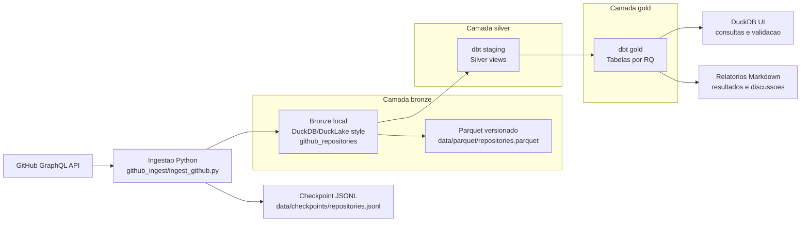
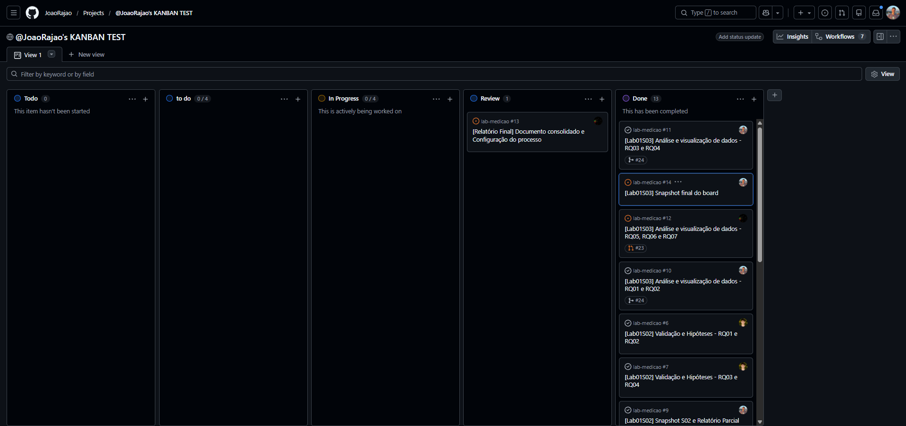

# Relatorio final - Laboratorio de medicao de repositorios GitHub

Repositorio: https://github.com/JoaoRajao/lab-medicao

## 1. Introducao

Este trabalho coleta dados de 1.000 repositorios populares do GitHub e organiza os resultados em uma arquitetura analitica local com Python, DuckDB, Parquet e dbt. O objetivo e responder questoes de pesquisa sobre idade, contribuicoes, releases, atualizacao, linguagens populares e manutencao por issues.

As hipoteses informais usadas como ponto de partida foram:

| RQ | Questao | Hipotese informal |
| --- | --- | --- |
| RQ01 | Qual a idade dos sistemas populares? | Sistemas populares tendem a ser maduros, com varios anos de existencia. |
| RQ02 | Sistemas populares recebem muitas contribuicoes externas? | Projetos populares tendem a acumular muitas pull requests aceitas. |
| RQ03 | Sistemas populares lancam releases com frequencia? | Projetos populares tendem a ter volume relevante de releases, mas com grande variacao entre projetos. |
| RQ04 | Sistemas populares sao atualizados com frequencia? | Projetos populares tendem a ter atualizacoes recentes. |
| RQ05 | Sistemas populares sao escritos nas linguagens mais populares? | A maioria deve estar concentrada nas linguagens populares, mas nao exclusivamente. |
| RQ06 | Sistemas populares possuem alto percentual de issues fechadas? | Projetos populares tendem a manter alto percentual de issues fechadas. |
| RQ07 | Linguagens populares recebem mais contribuicao, releases e atualizacao? | Repositorios em linguagens populares tendem a ter mais PRs aceitas, mais releases e atualizacoes mais recentes. |

Para RQ05 e RQ07, a definicao de "linguagens mais populares" foi mantida de forma unica durante o laboratorio:

- Fonte: GitHub Octoverse 2025
- URL: https://octoverse.github.com/
- Arquivo local: `github_ingest/config/popular_languages.json`
- Linguagens consideradas populares: TypeScript, Python, JavaScript, Java, C++ e C#.

## 2. Metodologia de coleta

A coleta foi implementada em Python no script `github_ingest/ingest_github.py`. O script usa a API GraphQL do GitHub por meio da biblioteca padrao `urllib`, sem PyGithub, SDK do GitHub, cliente GraphQL externo ou biblioteca de terceiros para consultar a API.

O fluxo de coleta executa duas etapas:

1. Busca paginada dos repositorios:
   - query padrao: `stars:>1000 archived:false fork:false sort:stars-desc`;
   - limite: 1.000 repositorios, que e o limite maximo retornado pela busca do GitHub;
   - pagina controlada por `pageInfo.hasNextPage` e `pageInfo.endCursor`;
   - tamanho de pagina configuravel por `--page-size`.

2. Coleta detalhada por repositorio:
   - identificacao (`repo_id`, `full_name`, `owner`, `name`, URL);
   - popularidade (`stars_count`, `forks_count`, `watchers_count`);
   - linguagem primaria e classificacao de linguagem popular;
   - issues abertas e fechadas;
   - pull requests aceitas;
   - releases;
   - datas de criacao, atualizacao e ultimo push;
   - metadados como branch padrao, licenca, arquivado, desabilitado e fork.

O script tambem usa checkpoint em JSONL para retomar a coleta em caso de rate limit ou interrupcao. Ao final, grava:

- DuckDB local: `github_ingest/data/github.duckdb`;
- Parquet versionado: `github_ingest/data/parquet/repositories.parquet`;
- tabela bronze de origem: `github_repositories`.

## 3. Arquitetura e processamento

O processamento usa DuckDB como mecanismo analitico local e dbt como camada de transformacao. Essa escolha reduz infraestrutura para o laboratorio: nao e necessario subir servidor de banco, cluster distribuido ou servico externo. O mesmo arquivo local atende a ingestao, a execucao dbt, a DuckDB UI e consultas ad hoc.

O Parquet foi escolhido como formato de intercambio porque e colunar, compacto, facil de versionar no contexto do laboratorio e lido diretamente pelo DuckDB. A bronze fica materializada em DuckDB/Parquet. No desenho arquitetural, essa area funciona como uma bronze local em estilo DuckLake/lakehouse: dados brutos normalizados da coleta, consultaveis por SQL e reutilizaveis pelo dbt.

O dbt organiza o pipeline medalhao:

- Bronze: tabela `github_repositories`, escrita pela ingestao Python no DuckDB e exportada para Parquet.
- Silver: modelos em `models/staging/github`, que padronizam a leitura e expõem datasets intermediarios.
- Gold: modelos em `models/gold/github`, com agregacoes finais para cada RQ.



Os modelos e testes foram executados com:

```bash
DBT_PROFILES_DIR=.tmp_dbt_profiles dbt run --select staging.github gold.github
DBT_PROFILES_DIR=.tmp_dbt_profiles dbt test --select staging.github gold.github
```

Resultado da execucao:

- `dbt run`: 10 modelos processados com sucesso.
- `dbt test`: 23 testes executados com sucesso.

## 4. Resultados por RQ

### RQ01 - Idade dos sistemas populares

| Metrica | Valor |
| --- | ---: |
| Repositorios | 1000 |
| Media de idade em dias | 2.792,27 |
| Mediana de idade em dias | 2.819 |
| Minimo em dias | 0 |
| Maximo em dias | 6.698 |

Resultado: a mediana de 2.819 dias indica que boa parte dos projetos populares possui varios anos de existencia.

### RQ02 - Pull requests aceitas

| Metrica | Valor |
| --- | ---: |
| Repositorios | 1000 |
| Media de PRs aceitas | 4.317,65 |
| Mediana de PRs aceitas | 798 |
| Minimo | 0 |
| Maximo | 103.013 |

Resultado: a media muito maior que a mediana indica distribuicao assimetrica, com poucos projetos concentrando volumes muito altos de PRs aceitas.

### RQ03 - Releases

| Metrica | Valor |
| --- | ---: |
| Repositorios | 1000 |
| Media de releases | 129,34 |
| Mediana de releases | 42 |
| Minimo | 0 |
| Maximo | 1.000 |

Resultado: a mediana de 42 releases indica uso relevante de releases em parte significativa da amostra, mas o minimo zero mostra que nem todo projeto popular usa releases do GitHub como mecanismo formal.

### RQ04 - Atualizacao

| Metrica | Valor |
| --- | ---: |
| Repositorios | 1000 |
| Media de dias desde a ultima atualizacao | 99,02 |
| Mediana de dias desde a ultima atualizacao | 1 |
| Minimo | 0 |
| Maximo | 2.445 |

Resultado: a mediana de 1 dia indica que a maior parte dos projetos populares estava muito ativa no momento da coleta. A media maior mostra a presenca de outliers antigos.

### RQ05 - Sistemas populares sao escritos nas linguagens mais populares?

Metrica: linguagem primaria de cada repositorio.

| Linguagem primaria | Popular pela fonte? | Repositorios | Percentual |
| --- | --- | ---: | ---: |
| Python | Sim | 229 | 22,9% |
| TypeScript | Sim | 172 | 17,2% |
| JavaScript | Sim | 105 | 10,5% |
| Unknown | Nao | 83 | 8,3% |
| Go | Nao | 80 | 8,0% |
| Rust | Nao | 61 | 6,1% |
| C++ | Sim | 44 | 4,4% |
| Java | Sim | 40 | 4,0% |
| Jupyter Notebook | Nao | 24 | 2,4% |
| C | Nao | 21 | 2,1% |
| Shell | Nao | 20 | 2,0% |
| Ruby | Nao | 12 | 1,2% |

Agrupando pelo criterio do Octoverse 2025:

| Grupo | Repositorios |
| --- | ---: |
| Linguagens populares | 598 |
| Demais linguagens ou sem linguagem | 402 |

Resultado: 59,8% dos repositorios estao nas linguagens classificadas como populares. A hipotese e parcialmente confirmada: existe concentracao nas linguagens populares, mas a presenca de Go, Rust, C, Shell, Ruby e 83 repositorios sem linguagem primaria mostra que sistemas populares nao dependem exclusivamente dessas linguagens.

### RQ06 - Percentual de issues fechadas

Metrica: `closed_issues_ratio = closed_issues_count / total_issues_count`.

| Faixa | Repositorios | Mediana da razao | Razao ponderada |
| --- | ---: | ---: | ---: |
| alto_80_100 | 626 | 0,9444 | 0,9216 |
| medio_50_79 | 224 | 0,6889 | 0,7068 |
| baixo_0_49 | 109 | 0,3424 | 0,3131 |
| sem_issues | 41 | n/a | n/a |

Resultado: 626 repositorios estao na faixa de 80% a 100% de issues fechadas. A hipotese e confirmada para a maior parte da amostra, mas ha 109 repositorios abaixo de 50% e 41 sem issues, que precisam ser tratados como excecoes/limitacoes.

### RQ07 - Linguagens populares, contribuicao, releases e atualizacao

Metricas:

- contribuicao externa: `accepted_pull_requests`;
- releases: `releases_count`;
- atualizacao: `days_since_last_update`, onde menor valor significa atualizacao mais recente.

| Grupo | Repositorios | Mediana PRs aceitas | Mediana releases | Mediana dias desde update |
| --- | ---: | ---: | ---: | ---: |
| linguagem_popular | 598 | 979,5 | 55,0 | 1,0 |
| outras_linguagens | 402 | 612,5 | 27,5 | 3,0 |

Resultado: a hipotese e moderadamente confirmada. O grupo de linguagens populares apresenta medianas maiores de PRs aceitas e releases, alem de menor mediana de dias desde a ultima atualizacao. Ainda assim, linguagens fora do conjunto definido, como Go e Rust, aparecem com projetos muito ativos, entao a linguagem deve ser vista como associada ao ecossistema do projeto, nao como causa isolada.

## 5. Discussao geral: hipotese vs resultado

As RQs mostram que os repositorios populares tendem a ser maduros, ativos e com grande volume de contribuicoes, mas quase todas as metricas apresentam distribuicoes assimetricas. Em RQ02 e RQ03, as medias sao puxadas por projetos muito grandes, entao a mediana e uma medida mais adequada para descrever o comportamento tipico.

A RQ04 reforca a ideia de atividade recente: mediana de apenas 1 dia desde a ultima atualizacao. A RQ06 tambem sugere maturidade de manutencao, ja que a maioria esta na faixa mais alta de issues fechadas.

Nas RQs ligadas a linguagem, a evidencia e mais cautelosa. RQ05 mostra maioria em linguagens populares, mas nao uma dominancia absoluta. RQ07 indica vantagem do grupo de linguagens populares nas tres metricas analisadas, porem os outliers em outras linguagens impedem uma conclusao causal forte.

## 6. Configuracao do processo

O trabalho foi organizado no GitHub usando Issues, branches, Pull Requests e um GitHub Projects v2. O fluxo observado no repositorio separa as atividades por sprint/laboratorio e por conjunto de RQs.

Link do repositorio:

- https://github.com/JoaoRajao/lab-medicao

Link do GitHub Projects:

- https://github.com/users/JoaoRajao/projects/4

Issues verificadas:

| Issue | Estado | Tema |
| --- | --- | --- |
| #1 | Fechada | Ingestao e processamento com script GraphQL |
| #2 | Fechada | Setup do Kanban e validacao RQ01 a RQ04 |
| #3 | Fechada | Estrutura do repositorio e validacao RQ05 a RQ07 |
| #4 | Fechada | Exportacao do snapshot S01 |
| #5 | Fechada | Paginacao GraphQL e exportacao CSV |
| #6 | Fechada | Validacao e hipoteses RQ01 e RQ02 |
| #7 | Fechada | Validacao e hipoteses RQ03 e RQ04 |
| #8 | Fechada | Validacao e hipoteses RQ05, RQ06 e RQ07 |
| #9 | Fechada | Snapshot S02 e relatorio parcial |
| #10 | Aberta | Analise e visualizacao RQ01 e RQ02 |
| #11 | Aberta | Analise e visualizacao RQ03 e RQ04 |
| #12 | Aberta | Analise e visualizacao RQ05, RQ06 e RQ07 |
| #13 | Aberta | Relatorio final e configuracao do processo |
| #14 | Aberta | Snapshot final do board |

Configuracao do board:

- GitHub Projects v2: `@JoaoRajao's KANBAN TEST`.
- Cartoes: Issues reais do repositorio, evitando draft issues soltas.
- Responsaveis: definidos pelo campo `Assignee`.
- Snapshot de sprint: exportado por `github_ingest/export_project_snapshot.py` para CSV em `github_ingest/data/project_snapshots/`.

Colunas/status do board:

| Coluna | Uso |
| --- | --- |
| Backlog | Tarefas mapeadas, ainda sem priorizacao imediata. |
| To Do / Todo | Tarefas priorizadas, mas ainda nao iniciadas. |
| Doing / In Progress | Tarefas em desenvolvimento ou analise. |
| Review | Tarefas com PR aberto, aguardando revisao ou validacao. |
| Done | Tarefas concluidas e evidenciadas. |

Politica de WIP:

- Limite de WIP na coluna Doing/In Progress: 3.
- Justificativa: o grupo possui tres integrantes; com WIP igual ao numero de integrantes, cada pessoa mantem no maximo uma tarefa em andamento por vez.
- Uma tarefa deve ir para Review apenas quando houver branch, commit e evidencia minima de execucao.
- Uma Issue deve ser fechada por PR associado ou por evidencia registrada no proprio card.

Snapshots exportados:

| Sprint | Arquivo | Data de exportacao |
| --- | --- | --- |
| Lab01S01 | `github_ingest/data/project_snapshots/snapshot_Lab01S01_2026-08-14.csv` | 2026-08-14 |
| Lab01S02 | `github_ingest/data/project_snapshots/snapshot_Lab01S02_2026-08-20.csv` | 2026-08-20 |

No snapshot S02, havia tarefas em `Done`, `Review`, `In Progress` e `Todo`, refletindo o fluxo real de trabalho: coleta/exportacao concluida, validacoes em revisao, relatorio parcial em andamento e tarefas de S03 ainda a iniciar.

### Snapshot final do board

Inserir aqui o print final do board ao encerrar o laboratorio:

```markdown

```

Link do board:

- https://github.com/users/JoaoRajao/projects/4

## 7. Conclusao

O pipeline conseguiu coletar 1.000 repositorios populares, persistir os dados em DuckDB/Parquet, transformar as camadas silver e gold com dbt e validar os resultados com testes automatizados. Os resultados sustentam a maior parte das hipoteses iniciais, principalmente sobre maturidade, atividade recente e alto percentual de issues fechadas. Para linguagens populares, os resultados indicam associacao positiva, mas com excecoes importantes em ecossistemas como Go e Rust.
