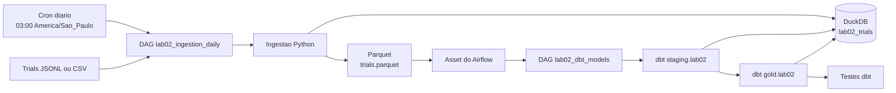

# Lab02 - Assistentes de IA vs codificacao manual

Experimento controlado (crossover within-subject) comparando resolucao de katas em Python com e
sem assistente de IA (ChatGPT). Sprint 1: desenho do experimento + preparacao (katas, cronometragem,
metricas estaticas, pipeline dbt).

Todos os comandos abaixo rodam a partir da raiz do repositorio, com o ambiente da raiz ativado
(`pip install -r requirements.txt`, ver README raiz).

## Estrutura

```text
labs/lab02_ia_vs_manual/
  katas/                        # 6 katas autorais com testes pytest de aceitacao
  scripts/
    run_trial_timer.py           # Cronometra um trial via start/check/stop (time-to-green, censura em 35 min)
    collect_static_metrics.py    # Coleta Radon (cc/raw/mi) e jscpd (duplicacao)
    consolidate_trial_records.py # Une tempo e metricas dos seis trials reais P2
    ingest_trials_to_parquet.py  # Converte JSONL/CSV de trials para o warehouse + Parquet
  data/
    raw/trials_sample.jsonl      # Dados de exemplo para validar o pipeline dbt
    parquet/trials.parquet       # Parquet gerado a partir da tabela lab02_trials
```

A tabela `lab02_trials` fica no warehouse compartilhado (`data/warehouse.duckdb`), como qualquer
outro lab -- ver `shared/warehouse.py` no README raiz.

## Dependencias

`pytest` e `radon` ja fazem parte do `requirements.txt` da raiz (`pip install -r requirements.txt`).
Nao ha requirements.txt proprio deste lab -- mesma convencao do resto do repositorio.

Duplicacao de codigo usa `jscpd` via `npx` (Node.js). Nao ha instalacao previa necessaria alem de
ter Node/npx disponivel -- `npx --yes jscpd ...` baixa sob demanda. Se `npx` nao estiver disponivel,
`collect_static_metrics.py` grava `duplication_pct` como `null` em vez de falhar.

## Validar a preparacao (dados de exemplo)

Colete os testes dos katas (devem coletar, mas falhar -- `solution.py` e um stub `NotImplementedError`
ate o trial real ser executado na Sprint 2):

```bash
python -m pytest --collect-only labs/lab02_ia_vs_manual/katas
```

Gere o warehouse + Parquet de exemplo a partir dos dados sinteticos:

```bash
python -m labs.lab02_ia_vs_manual.scripts.ingest_trials_to_parquet \
  --input labs/lab02_ia_vs_manual/data/raw/trials_sample.jsonl \
  --output labs/lab02_ia_vs_manual/data/parquet/trials.parquet
```

Rode o dbt:

```bash
dbt run --select staging.lab02 gold.lab02
dbt test --select staging.lab02 gold.lab02
```

## Executar um trial real (Sprint 2)

Para o participante P2 (Joao), execute os katas nesta ordem. O tratamento `manual` nao permite
assistente de IA durante a resolucao; `ai_assisted` permite. O arquivo de exemplo
`trials_sample.jsonl` contem dados sinteticos e nao substitui os trials reais.

| Ordem | Kata | Tratamento |
| --- | --- | --- |
| 1 | `warehouse_batches` | `ai_assisted` |
| 2 | `route_reconciliation` | `manual` |
| 3 | `invoice_window` | `ai_assisted` |
| 4 | `sensor_anomaly` | `manual` |
| 5 | `support_queue` | `ai_assisted` |
| 6 | `dependency_unlock` | `manual` |

O cronometro funciona em tres etapas -- `start` marca o inicio real da tentativa, `check` roda os
testes quantas vezes quiser sem parar o relogio, e `stop` encerra o cronometro e grava o registro
com o tempo decorrido de verdade (nao o tempo de execucao do `pytest`, que e quase instantaneo).
Em um terminal, inicie o cronometro do primeiro kata; em outro, edite o `solution.py`
correspondente:

```bash
python -m labs.lab02_ia_vs_manual.scripts.run_trial_timer start \
  --participant P2 \
  --kata warehouse_batches \
  --treatment ai_assisted \
  --assistant "<nome do assistente>"

# ... escreva a solucao em labs/lab02_ia_vs_manual/katas/warehouse_batches/solution.py ...

python -m labs.lab02_ia_vs_manual.scripts.run_trial_timer check \
  --participant P2 \
  --kata warehouse_batches \
  --treatment ai_assisted

python -m labs.lab02_ia_vs_manual.scripts.run_trial_timer stop \
  --participant P2 \
  --kata warehouse_batches \
  --treatment ai_assisted \
  --output labs/lab02_ia_vs_manual/data/raw/trials_joao_timing.jsonl
```

Sem `--assistant` no `start`, o padrao e `"ChatGPT"`, so para nao quebrar registros antigos.

Depois de cada trial, antes de alterar a solucao, colete as metricas estaticas. Troque `kata` e
`treatment` conforme a tabela para os outros cinco trials:

```bash
python -m labs.lab02_ia_vs_manual.scripts.collect_static_metrics \
  --trial-id P2-warehouse_batches-ai_assisted \
  --participant P2 \
  --kata warehouse_batches \
  --treatment ai_assisted \
  --solution-path labs/lab02_ia_vs_manual/katas/warehouse_batches/solution.py \
  --output labs/lab02_ia_vs_manual/data/raw/trials_joao_metrics.jsonl
```

Depois dos seis trials, consolide os dois JSONL. O script recusa IDs ausentes, duplicados, fora da
ordem P2 ou com tratamentos inconsistentes:

```bash
python -m labs.lab02_ia_vs_manual.scripts.consolidate_trial_records
```

O resultado fica em `labs/lab02_ia_vs_manual/data/raw/trials_joao.jsonl`. Para testar a ingestao,
aponte `ingest_trials_to_parquet.py --input` para esse arquivo. A ingestao substitui a tabela de
trials e o Parquet compartilhados; combine com o grupo antes de substituir dados de outros
participantes ou de usar o arquivo como entrada da DAG do Airflow.

## Orquestracao diaria com Airflow

O ambiente em `docker-compose.yml` usa Airflow 3.3.1 com LocalExecutor e PostgreSQL para os
metadados. A interface fica em <http://localhost:8080> e, no ambiente local, o usuario e senha
padrao sao `airflow` / `airflow`.

Inicialize e suba os servicos a partir da raiz:

```bash
docker compose build
docker compose up airflow-init
docker compose up -d
```

Em Linux, execute os comandos com `AIRFLOW_UID=$(id -u)` para que os logs criados pelo container
continuem pertencendo ao seu usuario. Para encerrar os servicos sem remover os metadados:

```bash
docker compose down
```

As DAGs ficam em `airflow/dags/lab02_pipeline.py`:

- `lab02_ingestion_daily`: roda todos os dias as 03:00 no fuso `America/Sao_Paulo` e publica o
  Parquet como um Asset do Airflow.
- `lab02_dbt_models`: e disparada quando o Asset e atualizado; roda os modelos e, em seguida, os
  testes dbt de `staging.lab02` e `gold.lab02`.

Por padrao, a ingestao usa `trials_sample.jsonl`. Para processar os trials reais, informe um caminho
visivel dentro do volume `/opt/airflow/project`, por exemplo:

```bash
LAB02_TRIALS_INPUT=/opt/airflow/project/labs/lab02_ia_vs_manual/data/raw/trials.jsonl \
  docker compose up -d
```

O Parquet e exportado para um arquivo temporario e substituido apenas depois de uma escrita bem
sucedida. Cada DAG permite somente uma execucao ativa, e todas as tarefas que acessam o warehouse
usam o pool `lab02_duckdb`, de uma vaga, para impedir escrita concorrente entre as duas DAGs. Feche
a DuckDB UI antes de executar o fluxo, pois ela pode manter um lock externo no warehouse.



O diagrama completo, incluindo os servicos internos do Airflow, PostgreSQL, camadas de dados e as
decisoes arquiteturais, esta em
[`docs/lab02/airflow_architecture.md`](../../docs/lab02/airflow_architecture.md).

Para diagnosticar o ambiente pela linha de comando:

```bash
docker compose run --rm airflow-cli dags list
docker compose run --rm airflow-cli dags list-import-errors
docker compose run --rm airflow-cli dags test lab02_ingestion_daily 2026-09-11
docker compose run --rm airflow-cli dags test lab02_dbt_models 2026-09-11
```

## Katas

| Kata | Descricao |
| --- | --- |
| `warehouse_batches` | Consolidar lotes por produto, validade e prioridade. |
| `route_reconciliation` | Reconciliar rotas planejadas e executadas. |
| `invoice_window` | Calcular janelas de cobranca, descontos e atrasos. |
| `sensor_anomaly` | Detectar anomalias simples em leituras sequenciais. |
| `support_queue` | Priorizar fila de suporte por SLA e severidade. |
| `dependency_unlock` | Resolver ordem de desbloqueio de tarefas com dependencias. |

Katas autorais e pouco indexados, para reduzir o risco de o assistente de IA reproduzir uma solucao
ja vista no treinamento em vez de efetivamente ajudar. Detalhes do desenho experimental (hipoteses,
variaveis, ordem contrabalanceada, ameacas a validade) em
[`docs/lab02/experiment_design.md`](../../docs/lab02/experiment_design.md).
